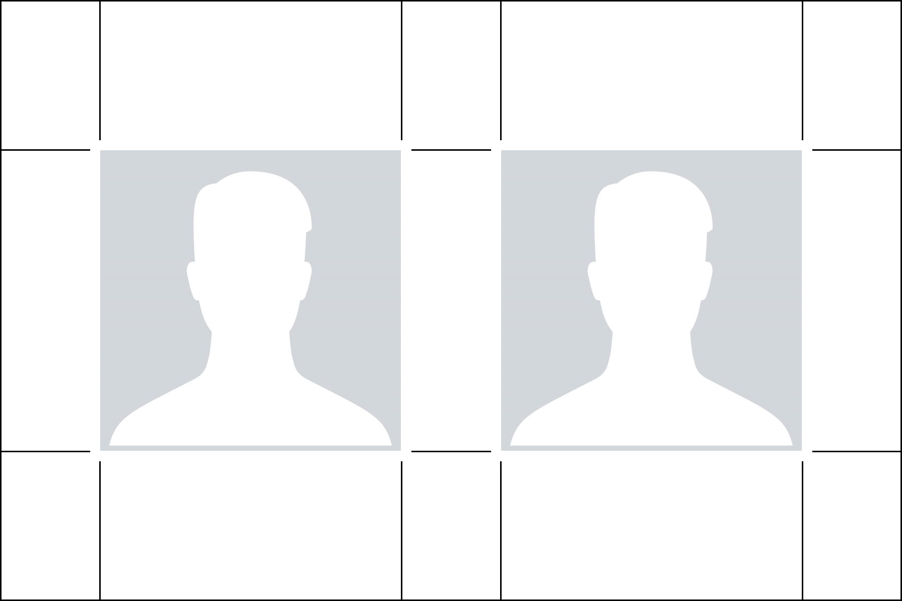

## US passport photo
You can use this tool to create a 6x4" picture containing 2 2x2" US passport photos. The output picture has scissor cut marks to help you cut the 2 passport photos.

### Usage
First, you have to crop and resize the input photos to 600x600 pixels. Then, you can use the tool in the following way:
```
./us_passport_photo.py left_pic.png right_pic.png example.png
```

The output is a 300 DPI image file that looks like this:

